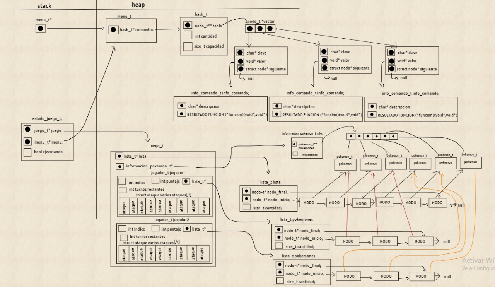

<div align="right">

</div>

# TP2

## Repositorio de Marianela fernanda Gareca Janko - 109606 - fernanda.gareca321@gmail.com

- Para compilar:

```bash
make main
```

- Para ejecutar:

```bash
./main
```

- Para ejecutar con valgrind:
```bash
make
```
---
##  Funcionamiento

###  Estructuras de Adversario

```c
typedef struct pokes_usados {
	char nombre_pokes[50];
	lista_t *ataques;
	int posibilidades;
	int indice;
} pokes_usados_t;

struct adversario {
	lista_t *pokes;
	lista_t *elegidos;
	pokes_usados_t usados[3];
};
```
En adversario agregue una lista `lista_t*pokes` para los pokemones que recibe la función adversario crear, la lista de todos los pokemones disponibles,también agregue una lista para los pokemones que elige el adversario `lista_t* elegidos`, eligió un alista porque quería preservar el orden de los pokemones, y porque la implementación de selección de cada jugada necesitaba buscar el elemento en una determinada posición y las funciones de lista me lo permitían,también cree un vector de estructuras `pokes_usados_t usado[3]` tiene 3 posiciones porque son la cantidad de pokemones de cada jugador,y en cada posición agregue un string`char nombres pokes[50]` para tener el nombre de cada Pokémon , tambien agregue una lista donde pondré los ataques `lista_t* ataques` de cada Pokémon según el nombre que tiene `nombre poke` ,el entero `int posibilidades` lo utilizó para sumar las veces que se utiliza un ataqué de la lista ,de ese modo si suma 3 ya sé que utilizó todos sus ataques de esa posición y puedo eliminar al Pokémon correspondiente al string  `nombre poke`, el entero `int índice` lo utilice para ir cargando los ataques en las listas.

## estructuras de juego
```c
typedef struct jugador {
	lista_t *pokemones;
	int puntaje;
	size_t turnos_restantes;
	struct ataque varios_ataques[9];
	int indice;
} jugador_t;

struct juego {
	lista_t *lista;
	informacion_pokemon_t *info_pokes;
	jugador_t jugador1;
	jugador_t jugador2;
};

```
En la estructura de juego agregue `lista_t* lista` para guardar los todos los pokemones, también agregue un campo para guardar la info de pokemones `información pokemon_t* info pokes`, y agregue dos jugadores uno para cada jugador `jugador_t jugador1` para el usuario y `jugador_t jugador2` para el adversario. En la estructura `jugador_t` agregue una lista para que cada uno guarde sus pokemones seleccionados, quería preservar el orden de selección, agregue un vector `atruct ataque varios ataque[9]` en la que guardo todos los ataques de los pokemones para ir descartando jugadas repetidas y validar casos, agregue un campo `int puntaje` para guardar los puntajes de cada jugador y otro entero `int turnos restantes` para ir restando las rondas permitidas.

## Diagrama de memoria de juego

En la función `juego crear` reservo memoria para `juego_t` en el heap, la cual tiene dos jugadores y cada jugador tiene una lista para
sus pokemones, reservo memoria para ambas listas, la estructura de juego también tiene un puntero a la `información pokemone_t` para
guardar toda la información de los pokemones en la función `juego cargar archivo`, por último juego tambien tiene un puntero a la lista
con todos los pokemones.

<div align="center">

</div>

---
## Diagrama de memoria de adversario


En la función `adversario crear` reservo memoria para `adversario_t` que contiene un puntero al la lista con todos los pokemones 
`lista_t pokes` y otro puntero a la lista del los 3 pokemones del adversario`lista_t* elejidos` para la cual reservo memoria,también
cree un vector de 3 posiciones de tipo `pokes_usados_t` donde cada posición tiene un puntero a una lista con ataques del pokemon segun el 
nombre del string `char nombre poke` para la cuales tambien reservo memoria en `adversario crear`.

<div align="center">

</div>

---
## Diagrama de memoria de menu


En la función `menu crear` reservo memoria para un menú en el heap, la cual contiene un `hash_t* comandos` donde guardo una estructura para
la información de los comandos`info comando_t` que contiene una descripción y una función a ejecutar según el comando,tambien cree la
estructura `estado juego_t` para guardar un puntero al juego y un puntero al menú, junto con un booleano que marca cuando el juego esta 
ejecutándose o no 


<div align="center">

</div>


## Implementacion de juego


En la función `juego cargar Pokémon` verificó que el juego y el archivo no sean null, después cargo el campo info de la estructura de juego verificando que la función `Pokémon cargar archivo` devuelva una información válida, en caso de que la cantidad de pokemones sea menor a la mínima ,liberoa la memoria reservada y  retorno POKEMONES INSUFICIENTES.
### complejidad
 La complejidad de esta funcion es:
 la funcion `pokemon cargar archivo` lee too el archivo de pokemones por lo que hace un trabajo O(n) y en el caso de tene que destruir la informacion de pokemones porque no son suficientes se eliminan todos los elementos que tambien seria un trabajo O(n) .por lo que la complejidad es O(n)+O(n) = O(n).

---
 En la función `juego listar pokemon` verifico que el juego exista, y cargo la lista de la estructura juego con todos los pokemones que se encuentran en la info de pokemones y devuelvo la lista.

### complejidad

La funcion `con cada pokemon` recorre todos los elementos cargados y le aplica la funcion enviada por lo que seria O(n) ,despues en la fucnion que
se les aplica `funcion insertar pokes` hago una insercion O(1) ya que enserta al final segun mi inplemtacion por lo que estoy haciendo un trabajo n*O(1) ya que 
`lista insertar` inserta al final teniendo un puntero al ultimo elmento.por  lo que en toda la funcion la complejidad seria O(n).

---

En la función `juego seleccionar Pokémon` verifico que el juego y los nombres recibidos no sean null , verifico que los nombres no se repitan y que dichos pokemones existan, segun el tipo de jugador inserto en su lista los primeros 2 pokemones, pero el 3.er Pokémon lo inserto en la lista del otro jugador, cargo los ataques en el vector del jugador correspondiente para usarlo despues,use listas para guaradar los pokemones de cada jugador porque quise preservar el orden de 
seleccion y porque son solo 3 pokemones.

### complejidad
En la función se utiliza `strcmp` para comparar los nombres ingresados lo cual haría un trabajo O(n) porque recorrer todos los caracteres, pero como estamos evaluando con respecto a la cantidad de pokemones lo tomare como constante, buscar los pokemones en el peor caso es lineal, ya que deberíamos recorrer toda la lista 1 vez para cada Pokémon, lo que seria n+n+n =3*n, después para insertar los pokemones en sus correspondientes listas hacemos un trabajo constante, porque la funcion `lista insertar` inserta al final de la lista y la función `lista insertar en posición`, siempre inserto en la posicion 0 lo que también es constante 3*O(1), pero para cargar los ataques en la función`con cada ataque` recorro todos los ataques de cada Pokémon y le aplico la función `función insertar` que inserta los ataques en el vector del jugador lo que termina teniendo un costo lineal por lo que la complejidad de todo la función seria  3*n + 3*O(1) + 3*(n) = O(n).

---

En la función `juego jugar turno` verifico que los pokemones existan en la lista de pokemones, en caso contrario retorno el resultado, después buscó los ataques de cada jugada recibida y en la función `se encuentra` recorro el vector de ataque que cargue previamente, buscando el ataque de la jugada, y cada vez que lo encuentra cambio el nombre del ataque ha usado para que cuando lo vuelva a buscar ese ataque no lo encuentre y no pueda usar una ataque que ya fue usado, en caso que el ataque no se encuentre salgo de la función retornando el resultado vacio, caso contrario calculo que si el ataque de cada jugador es efectivo en la función `ataque efectivo` y por último sumo los puntos correspondientes en el campo puntaje de cada jugador, devuelvo el resultado.

### complejidad 
El costo de buscar los pokemones en la lista en la función `lista buscar elemento` en lineal, ya que debería recorrer toda la lista en el peor caso, después busco el ataque ingresado lo cual realiza un trabajo lineal para cada Pokémon y en la función `se encuentra` busco el ataque recibido en el peor caso tendría que recorrer todo el vector, la función `ataque efectivo` es contante` porque solo compara los tipos, la función `puntos` también es constante porque solo hace cuentas por lo que la complejidad termina siendo 2*O(n)+2*O(n)+2*O(n)+ 2*O(1)+2*O(1) = O(n).

---

En la función `juego obtener puntaje` devuelvo el puntaje según el jugador recibido, si el juego lo existe devuelvo 0,los puntajes los guarde en una campo en la estructura de jugador
### complejidad 
La funcion es constante ya que guarde los puntajes en un campo por lo que el trabajo es O(1).

---

En la función `juego finalizado` devuelve false mientras los 9 turnos en total no se hayan acabado, si los turnos que se van restando en `juego jugar turno` legan a 0 el juego la función devuelve true.
### complejidad
la funciones contante ya que guarade los turnos permitidos en un campo de cada jugador.

---

En la funcion `juego_destruir` si el juego no existe salgo caso contrario libero la lista de todos los pokemones en la funcion`lista destruir` 
libero las listas de cada jugador ,libero la informacion de todos los pokemones y libero el juego.

### complejidad
La complejidad de destruir las 3 listas es n+n+n = 3*n, al liberar la información también recorro todos los elementos por lo que es O(n) y al final libero el juego por lo que la complejidad de toda función es O(n).

---

## Implementaciond e adversario

---
En la función `adversario seleccionar Pokémon` genero 3 números aleatorios diferentes que serán las posiciones de los pokemones en la lista de todos los pokemones del adversario, en la función`obtener nombre` busco el nombre del Pokémon en esa posición y guardamos el nombre, después insertamos en la lista del adversario los dos primero pokes que le corresponden, completamos el vector del adversario con los nombres de los pokemones y cargamos la lista que de cada celda con los ataques de cada Pokémon

## complejidad

La complejidad de la función rand() es O(1), buscas los pokemones en según la posición es o(n) en el peor caso y cargar la lista con los pokemones es O(1), ya que la función `lista insertar` inserta al final de la lista que según mi implementación es o(1), ya que mi lista tiene un puntero al último elemento por oro lado tener que cargar todos los ataques en las listas de cada celda tiene un trabajo de O(n), ya que debo recorrer todas las posiciones e ir llenando las listas por lo que la complejidad seria O(n)+O(1)+O(n) = O(n)

---
En la función `adversario Pokémon seleccionado` busco al último Pokémon del adversario e inserto en su lista, también cargo la lista del vector de listas que contiene los ataques posibles de cada Pokémon del adversario

## complejidaa
La complejidad de buscar el Pokémon en la lista es O(n), cargarlo en su lista de pokemones es O(1) porque inserta al final y tener que cargar todos losa taques es 3*O(1), ya que se inserta siempre al final de la lista y son 3 ataques por lo que la complejidad es O(n) + O(1) = O(n)

---
En la función `adversario próxima jugada` género un número aleatorio que se encuentre entre el rango de pokemones disponibles de su lista y busco el Pokémon en esa posición, después recorro el vector de listas de ataques buscando el nombre que coincida con el Pokémon, y genero otro número aleatorio según la cantidad de elementos que tenga la lista de ataque de esa posición, prosigo buscando el ataque y copio tanto el nombre del pokempon como del ataque en la jugada y elimino ese elemento de la lista de ataques de ese vector, después recorro otra vez la el vector de listas buscando la posición que coincida con el Pokémon cargado en la jugada y sumo las posibilidades, en caso de que alguna posición tenga 3 posibilidades, cambio en nombre de la celda ha usado para que no vuelva a encontrar ese nombre cuando vuelva a recorrer el vector, y también elimino el Pokémon de esa posición de la lista de pokes del adversario para que siga generando números aleatorios dentro del rango de pokemones que tienen ataques sin utilizar.
 
 ## complejidad
Al buscar el Pokémon en la posición del número generado se hace un trabajo O(n) en el peor de los casos de tener que recorrer toda la lista de pokes, después al recorrer el vector que contiene en cada celda el nombre de los pokemones del adversario y una lista de ataques en cada posición hacemos un trabajo O(n) buscando el que coincida con el nombre del Pokémon, una vez encontrado buscamos en la lista el ataque de la posición generada por lo que el trabajo es lineal, más tener que eliminar el elemento de esa posición sigue siendo lineal, por último recorrer todo el vector para sumar las posibilidades que se están utilizando es O(n) y tener que eliminar de la lista en una posición determinada es  siendo n*n = n², por lo que la complejidad total es: O(n)+O(n)+O(n²).

---
En la función `adversario destruir` libero las 3 listas de ataques que utilice para cargar los ataques de cada poquemon, por lo que hacía un trabajo 3*n más liberar la lista de pokemones que es n y liberar por último al adversario,la lista pasada como parámetro al crear al adversario la libero en `juego destruir`la complejidad de esta función termina siendo O(n).